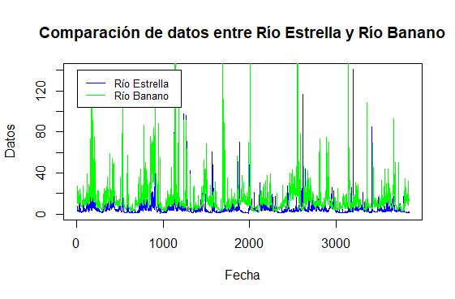
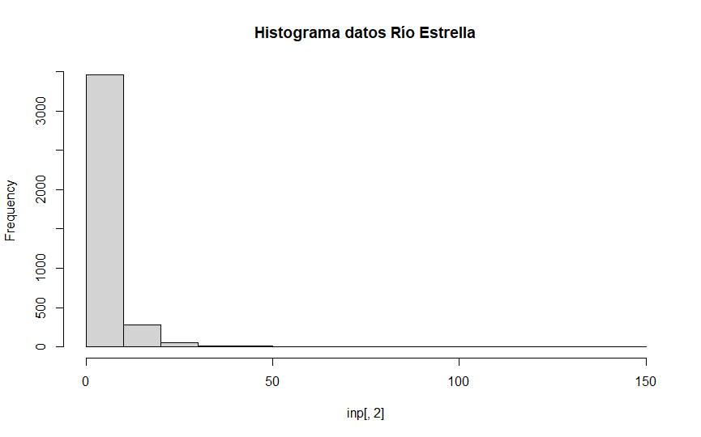
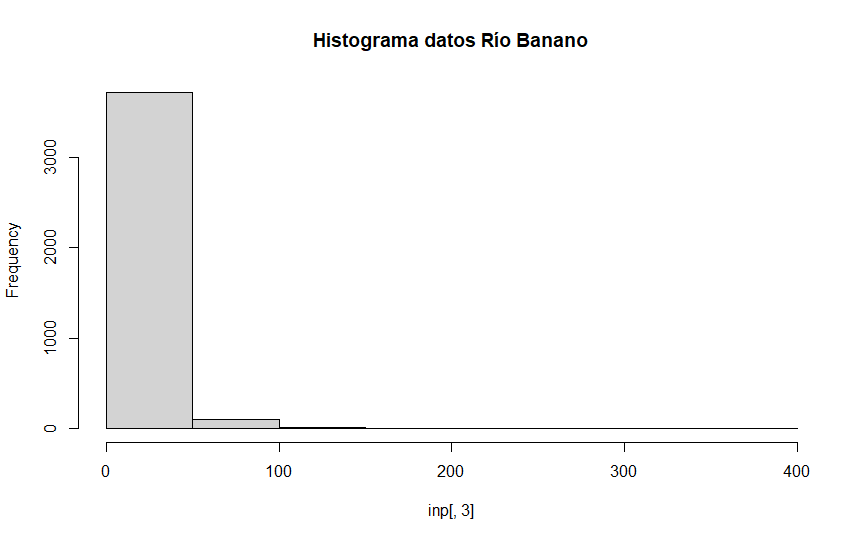

# Datos hidrológicos, ejercicio explorativo

## Cargando los datos del archivo CSV dentro de RStudio.

Es importante asegurarse fijar el _"working directory"_ en el folder donde se encuentre el archivo CSV, ya que si no el programa RStudio no puede hallar el archivo. Esto se logra mediante la función `setwd("C:/Users/[[nombre del usuario]]/[[dirección que de directamente al folder donde se encuentra el archivo]")`. La función `head(inp)` le ayuda a uno a verificar que se escogió el archivo correcto mostrando el comienzo de dicho documento; la función `dim(inp)` le da a uno las dimensiones del documento, en este caso siendo 3845 líneas y 3 columnas.  

> inp <- read.csv("FDC.csv", na.strings="")
>  
> head(inp)   
> dim(inp)
  
 ## Graficación de los datos.
 
 Una vez cargados los datos del CSV en la memoria, se procede a graficar los datos de la columna 2 y columna 3 del archivo CSV.
 
> plot(inp[,2], type = "l", col="blue",   
>&nbsp;&nbsp;&nbsp;&nbsp;&nbsp;&nbsp; main= 'Comparación de datos entre Río Estrella y Río Banano',  
>&nbsp;&nbsp;&nbsp;&nbsp;&nbsp;&nbsp; xlab = 'Fecha', ylab = 'Datos')  
>lines(inp[,3],col="green")  
>legend(1, 140, legend=c("Río Estrella", "Río Banano"),   
>&nbsp;&nbsp;&nbsp;&nbsp;&nbsp;&nbsp; col=c("blue","green"),lty=1:1, cex=0.8)

  
Gráfico resultado de las líneas de código anteriores

### Resumen de las variables e histogramas de estas.

La función `summary(inp[,2:3])` nos da un resumen de los datos presentes en las columnas 2 (Río Estrella) y 3 (Río Banano), presentando datos como: mínimo, 1° cuarto, mediana, media, 3° cuarto, y máximo. La función `hist` nos da un histograma de los datos de cada columna.

>summary(inp[,2:3])  
>hist(inp[,2], main = 
       'Histograma datos Río Estrella')  
>hist(inp[,3], main = 
       'Histograma datos Río Banano')
       
 
  
Histogramas resultado de las líneas de código anteriores

## Nombrando las columnas del dataframe.

La función `names` tiene como propósito darle nombre a las columnas de las variables del dataframe.

>names(inp) <- c("fecha", "Estrella", "Banano")  
>attach(inp)

En este caso se establece que los nombres de las columnas, en el orden que están en el dataframe, corresponden a la fecha en que se extrajeron los datos, los datos correspondientes al Río Estrella, y los datos de Río Banano. La siguiente función, `attach`, sirve para adjuntar estos nombres a la base de datos, facilitando así la redacción del código ya que no se ocuparía seguir utilizando los comandos de [,2] haciendo referencia a Río Estrella y [,3] haciendo referencia a Río Banano. Esto facilita además la comprensión del código a terceros.

### Agregando el valor de fecha a la columna 1

El lenguaje R no puede entender si un valor es una fecha por sí mismo, hay que darle a saber por medio de la función `Tempdate`. Se selecciona la columna [,1] ya que esta es la que guarda el dato de las fechas. El formato se da como día/mes/año al final de la línea de código.

>Tempdate <- strptime(inp[,1], format= "%d/%m/%Y")

## Calculando el mean annual streamflow (MAQ).

Gracias al lenguaje R, muchos cálculos de datos se pueden hacer de forma inmediata, tal como lo es el caso del "mean annual streamflow", creando un nuevo `value` dentro del "environment" de RStudio usando además el formato de fecha de año:

>MAQ_Estrella <- tapply(inp[,2], format(Tempdate, format= "%Y"), FUN=sum)  
>MAQ_Banano <- tapply(inp[,3], format(Tempdate, format= "%Y"), FUN=sum)

## Creando nuevos dataframes.

